# Analyzing-Netflix-Content

## Exploratory Data Analysis Using Netflix Dataset and Python

-   Libraries used: pyplot from matplotlib, pandas.

-   IDE used: Spyder

-   Dataset used: [Netflix Movies and TV Shows from
    Kaggle](https://www.kaggle.com/datasets/shivamb/netflix-shows)

### **Technical Stuff:**

First and foremost, importing pandas and matplotlib.pyplot

And read the csv to new dataframe.

```python
import pandas as pd
import matplotlib.pyplot as plt

netflix = pd.read_csv('netflix_titles.csv')
```

Next step is cleansing, there are few empty values, so I\'ll fill them
with ```unknown```.

```python
netflix.fillna(value="unknown", inplace = True) # fill NaNs with unknown
```

The dataframe looks something like this --

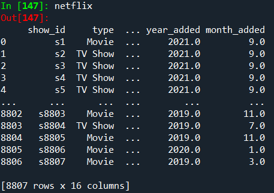

### **Let's start!** 🤘 ###


## 🔴 **Distribution of Genres**

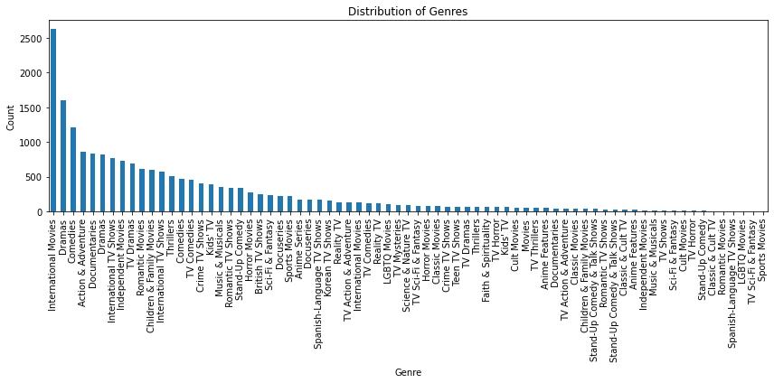

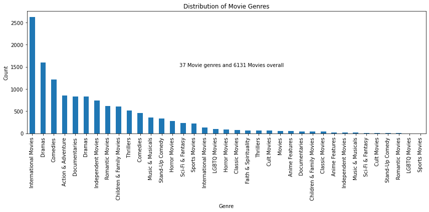

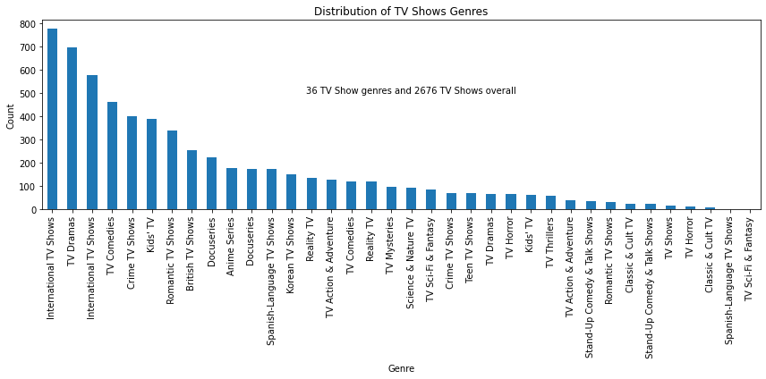

As we can see from the graphs above, Most of Netflix content is
International Movies and TV Shows. More than 2500 titles are
International Movies, and more than 700 titles are International TV
Shows.

Seems like International titles are on high demand.

On the last 2 graphs there is the number of titles in each type. 6131
Movies and 2676 TV Shows. This data corresponds to the next Pie chart
that shows that most of the content in Netflix are movies with 69.6% and
30.4% are TV Shows.

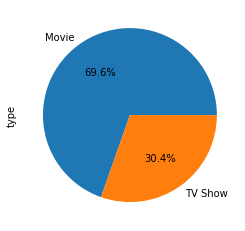

```python
# Distribution of genres
netflix["genres"] = netflix["listed_in"].str.split(',') # new column for genres
all_genres = []
for genres in netflix["genres"]:
    for genre in genres:
        all_genres.append(genre)
genre_counts = pd.Series(all_genres).value_counts()
plt.figure(figsize=(12, 6)) # increase size of the plot
genre_counts.plot(kind='bar')
plt.xlabel('Genre')
plt.ylabel('Count')
plt.title('Distribution of Genres')
plt.xticks(rotation='vertical')
plt.tight_layout()
plt.show() 

#-- Distribution of genres for movies and tv shows
# MOVIES
all_movies = netflix[netflix['type'].str.contains("Movie")]
movie_genres = [genre for genres in all_movies["genres"] for genre in genres] 
movie_genre_counts = pd.Series(movie_genres).value_counts()
plt.figure(figsize=(12, 6)) # increase size of the plot
movie_genre_counts.plot(kind='bar')
plt.xlabel('Genre')
plt.ylabel('Count')
plt.title('Distribution of Movie Genres')
plt.xticks(rotation='vertical')
plt.tight_layout()
plt_text_movies = f"{len(movie_genre_counts)} Movie genres and {len(all_movies)} Movies overall"
plt.text(len(movie_genre_counts)/2, 1500, plt_text_movies, color='black', fontsize=10, ha='center')
plt.show()

# TV SHOWS
all_tvshows = netflix[netflix['type'].str.contains("TV Show")]
tvshow_genres = [genre for genres in all_tvshows["genres"] for genre in genres] 
tvshow_genre_counts = pd.Series(tvshow_genres).value_counts()
plt.figure(figsize=(12, 6)) # increase size of the plot
tvshow_genre_counts.plot(kind='bar')
plt.xlabel('Genre')
plt.ylabel('Count')
plt.title('Distribution of TV Shows Genres')
plt.xticks(rotation='vertical')
plt.tight_layout()
plt_text_tvshows = f"{len(tvshow_genre_counts)} TV Show genres and {len(all_tvshows)} TV Shows overall"
plt.text(len(tvshow_genre_counts)/2, 500, plt_text_tvshows, color='black', fontsize=10, ha='center')
plt.show()

# Movies vs TV Shows
type_counts = pd.Series(netflix["type"]).value_counts()
type_counts.plot(kind='pie',autopct='%1.1f%%')
plt.show()
```

## 🔴 **Country of Origin**

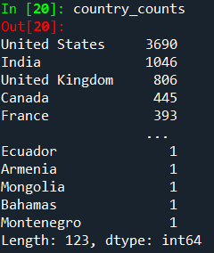

In the first place we can see that US is dominating with 3690 titles and
India in second place with 1046 titles.

Let\'s take the top 5 countries and put them in a horizontal bar plot.

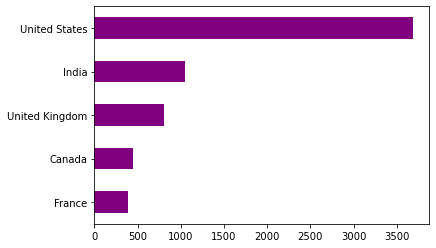

Let\'s take a further look at the US for example:

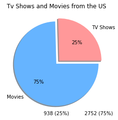

We can see that 75% of the titles from the US are movies, 2752 titles to
be exact and only 25% of the titles are tv shows (938 titles).

```python
## Country of origin
netflix["countries"] = netflix["country"].str.split(',')
all_countries = [country for countries in netflix["countries"] for country in countries]
all_countries = [country.lstrip() for country in all_countries] # remove unnecessary space from the start of values
country_counts = pd.Series(all_countries).value_counts()
country_counts = country_counts.drop(labels=['unknown']) # drop unknown values

# Top 5 countries in horizontal bar plot
country_counts.head(5).plot(kind='barh', color='purple', orientation="horizontal").invert_yaxis()
plt.show()

# Tv Shows and Movies from the US
us_tvshows = netflix[(netflix['type'].str.contains("TV Show")) & (netflix['country'].str.contains("United States"))]
us_movies = netflix[(netflix['type'].str.contains("Movie")) & (netflix['country'].str.contains("United States"))]
us_tvshows_count = len(us_tvshows)
us_movies_count = len(us_movies)
us_pie_lables = ['TV Shows', 'Movies']
us_pie_data = [us_tvshows_count, us_movies_count]
plt.pie(us_pie_data,labels=us_pie_lables, colors=['#ff9999', '#66b3ff'], explode=(0.1,0), shadow=True, autopct='%1.0f%%')
for i, size in enumerate(us_pie_data):
    percentage_label = f"{size} ({us_pie_data[i]/sum(us_pie_data)*100:.0f}%)"
    plt.text(i, -1.2, percentage_label, color='black', fontsize=10, ha='center')
plt.title('Tv Shows and Movies from the US')

```

## 🔴 **Distribution of Ratings**

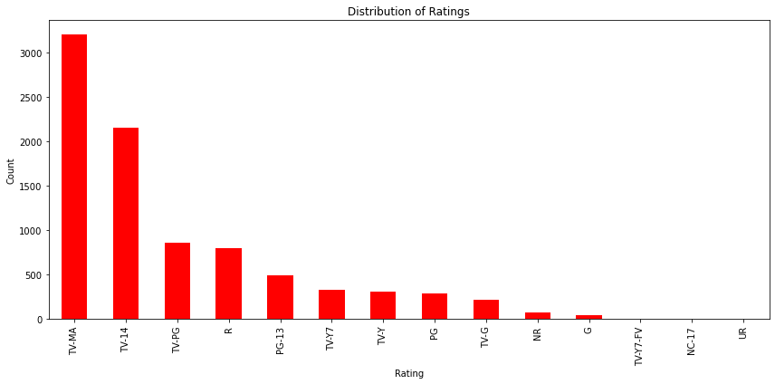

More than 3000 titles are marked as TV-MA rating which means that big
portion of the titles in Netflix is mature content which the audience
seems to like very much. In the next graph we\'ll see the progression.

```python
# Distribution of ratings
rating_counts = pd.Series(netflix['rating']).value_counts()
rating_counts = rating_counts.drop(labels=['unknown','74 min','84 min', '66 min']) # dropping duration time values which don't belong to rating and dropping unknown values.
plt.figure(figsize=(12,6))
rating_counts.plot(kind='bar', color='red')
plt.xlabel('Rating')
plt.ylabel('Count')
plt.title('Distribution of Ratings')
plt.tight_layout()
plt.show()
```

## 🔴 **Content Added Over the Years**

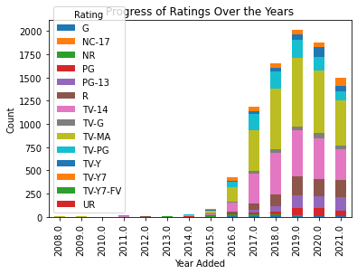

By this graph we can see that over the years TV-MA rating titles become
very popular since 2017 and are requested a lot. Also, we can see that
2019 was the year with the highest content added.

In addition, 2019 was the year with the highest number of movies and tv
shows added.

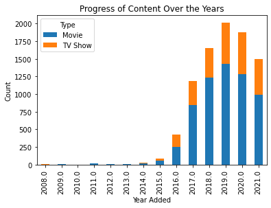

```python
## CONTECT ADDED OVER THE YEARS
netflix['date_added'].replace('unknown', pd.NaT, inplace=True)
netflix['date_added'] = netflix['date_added'].str.strip()
netflix['date_added'] = pd.to_datetime(netflix['date_added'], format='%B %d, %Y')
netflix['year_added'] = netflix['date_added'].dt.year
# Progress of Ratings Over the Years
ratings_to_exclude = ['unknown','74 min','84 min', '66 min'] # unknown and duration time values were excluded from rating.
filtered_df = netflix[~netflix['rating'].isin(ratings_to_exclude)] # filtered dataframe without them.
rating_counts = filtered_df.groupby(['year_added', 'rating']).size().unstack(fill_value=0)
plt.figure(figsize=(12, 6))
rating_counts.plot(kind='bar', stacked=True)
plt.xlabel('Year Added')
plt.ylabel('Count')
plt.title('Progress of Ratings Over the Years')
plt.legend(title='Rating')
plt.show()
# Difference of content added over the years
content_counts = netflix.groupby(['year_added', 'type']).size().unstack(fill_value=0)
plt.figure(figsize=(12, 6))
content_counts.plot(kind='bar', stacked=True)
plt.xlabel('Year Added')
plt.ylabel('Count')
plt.title('Progress of Content Over the Years')
plt.legend(title='Type')
plt.show()
```

## 🔴 **Overall Content Added Over the Months**


Looks like that near the end of the year is the time when Netflix adds
new content and lots of them!

```python
# Overall Content Added Over the Months
netflix['month_added'] = netflix['date_added'].dt.month
plt.hist(x="month_added",data=netflix, edgecolor='k', rwidth=0.5)
plt.xlabel('Month')
plt.ylabel("Count")
plt.title('Overall Content Added Over the Months')
plt.show()
```

## 🔴 **Distribution of Seasons of TV Shows**

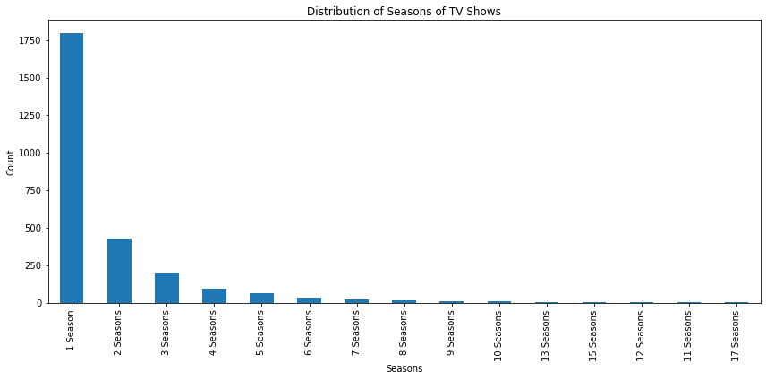

Looks like that every tv show has at least one season which is obvious but 
a tv show to have more than one season become very rare. Close to
1750 titles have one season but only approx. 500 titles got 2 seasons.

```python
# Distribution of Seasons of TV Shows
tvshows_only = netflix[netflix['type'].str.contains("TV Show")]
tvshows_season_count = pd.Series(tvshows_only['duration']).value_counts()
plt.figure(figsize=(12, 6)) # increase size of the plot
tvshows_season_count.plot(kind='bar')
plt.xlabel('Seasons')
plt.ylabel('Count')
plt.title('Distribution of Seasons of TV Shows')
plt.xticks(rotation='vertical')
plt.tight_layout()
plt.show()
```

## 🔴 **Top Directors for Movies and TV Shows**

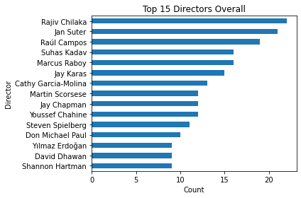
 
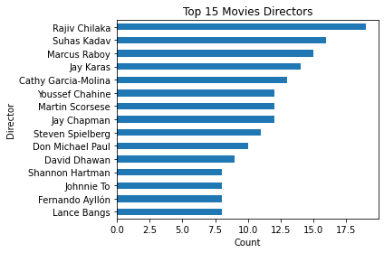

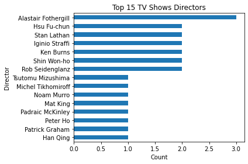

As shown in the graphs, Rajiv made more than 20 titles overall. Rajiv
is also in the first place in the Top 15 Movies Directors. Alastair is
in the first place in Top 15 TV Shows Directors with 3 titles.

```python
## Top Directors for Movies and TV Shows
# Top 15 Overall
netflix["directors"] = netflix["director"].str.split(',')
all_directors = [director for directors in netflix["directors"] for director in directors]
all_directors = [director.lstrip() for director in all_directors] # remove unnecessary space from the start of values
director_counts = pd.Series(all_directors).value_counts()
director_counts = director_counts.drop(labels=['unknown']) # drop unknown values
director_counts.head(15).plot(kind='barh').invert_yaxis()
plt.xlabel('Count')
plt.ylabel('Director')
plt.title('Top 15 Directors Overall')
plt.tight_layout()
plt.show()

# Top 15 Movies
only_movies_directors = netflix[(netflix['type'].str.contains("Movie")) & (netflix['director'].isin(all_directors))]
movies_directors_counts = pd.Series(only_movies_directors['director']).value_counts()
movies_directors_counts = movies_directors_counts.drop(labels=['unknown'])
movies_directors_counts.head(15).plot(kind='barh').invert_yaxis()
plt.xlabel('Count')
plt.ylabel('Director')
plt.title('Top 15 Movies Directors')
plt.tight_layout()
plt.show()

# Top 15 TV Shows
only_tv_directors = netflix[(netflix['type'].str.contains("TV Show")) & (netflix['director'].isin(all_directors))]
tv_directors_counts = pd.Series(only_tv_directors['director']).value_counts()
tv_directors_counts = tv_directors_counts.drop(labels=['unknown'])
tv_directors_counts.head(15).plot(kind='barh').invert_yaxis()
plt.xlabel('Count')
plt.ylabel('Director')
plt.title('Top 15 TV Shows Directors')
plt.tight_layout()
plt.show()
```

## 🔴 **Conclusions**

As we saw in this exploratory data analysis --

-   Movies playing a big part in Netflix\'s content.

-   The vast majority of the content is international.

-   Most of the titles coming from United States.

-   most of the title are mature rated (TV-MA).

-   Netflix likes to add new content when we reach the end of the year.

-   Not all TV shows get to see another season.
